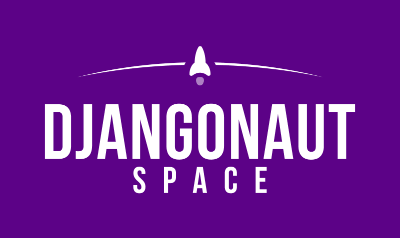

<a name="readme-top"></a>
<!--
*** build from Best-README-Template.
-->

<!-- PROJECT SHIELDS -->
[](https://github.com/djangonaut-space/wagtail-indymeet/actions/workflows/tests.yml)
<!-- [![Contributors][contributors-shield]][contributors-url]
[![Forks][forks-shield]][forks-url]
[![Stargazers][stars-shield]][stars-url]
[![Issues][issues-shield]][issues-url]
[![MIT License][license-shield]][license-url] -->

<!-- PROJECT LOGO -->
<br />
<div align="center">
  <a href="https://github.com/djangonaut-space/wagtail-indymeet/">
    
  </a>

  <h3 align="center">Djangonaut Space Website</h3>
</div>

<!-- TABLE OF CONTENTS -->
<details>
  <summary>Table of Contents</summary>
  <ol>
    <li>
      <a href="#about-the-project">About The Project</a>
      <ul>
        <li><a href="#built-with">Built With</a></li>
      </ul>
    </li>
    <li>
      <a href="#getting-started">Getting Started</a>
      <ul>
        <li><a href="#prerequisites">Prerequisites</a></li>
        <li><a href="#installation">Installation</a></li>
      </ul>
    </li>
    <li><a href="#documentation">Documentation</a></li>
    <li>
      <a href="#contributing">Contributing</a>
      <ul>
        <li><a href="#merging-changes">Merging Changes</a></li>
        <li><a href="#deployments">Deployments</a></li>
        <li><a href="#updating-dependencies">Updating Dependencies</a></li>
      </ul>
    </li>
    <li><a href="#license">License</a></li>
    <li><a href="#contact">Contact</a></li>
    <li><a href="#acknowledgments">Acknowledgments</a></li>
  </ol>
</details>

<!-- ABOUT THE PROJECT -->
## About The Project

This is the web application for the Djangonaut Space mentoring program. The platform is built with Django and Wagtail CMS. While it includes a Wagtail-based blog, the primary application is a Django system that manages:

- **Recurring application and ranking processes** for cohort selection
- **Session management** (cohorts/mentoring sessions) with participants, navigators, and captains
- **Application workflows** including surveys, review, scoring, and team formation
- **Team formation and management** with availability matching and project assignments
- **Email notifications** throughout the application and acceptance process

<p align="right">(<a href="#readme-top">back to top</a>)</p>

### Built With

* [Wagtail](https://wagtail.org)
* [Tailwind](https://tailwindcss.com)
* [Alpine.Js](https://alpinejs.dev)
* [Django](https://Djangoproject.com)

<p align="right">(<a href="#readme-top">back to top</a>)</p>

## Getting Started


### Prerequisites

* [Docker](https://docs.docker.com/get-started/introduction/get-docker-desktop/)

### Installation

1. Clone the repo
   ```sh
   git clone https://github.com/dawnwages/wagtail-indymeet.git
   ```

2. Copy `.env.template.docker` file, rename to `.env.docker` and update the secret key.
   Copy in Linux:
   ```sh
   cp .env.template.docker .env.docker
   ```
   activate in Windows:
   ```sh
   copy .env.template.docker .env.docker
   `````

3. Have docker running and then run:
   ```sh
   docker compose up
   ```

4. In a new terminal, run any setup commands you need such as
   ```sh
   docker compose exec django uv run python manage.py createsuperuser
   ```

5. Go to: http://127.0.0.1:8000/ and enjoy!


### Creating fixtures for local testing

**Backing up**
To create a fixture to share content with another person you should do the following:

```shell
docker compose exec django uv run python manage.py dumpdata --natural-foreign --indent 2 \
   -e contenttypes -e auth.permission \
   -e wagtailcore.groupcollectionpermission \
   -e wagtailcore.grouppagepermission \
   -e wagtailimages.rendition \
   -e sessions \
   -e admin \
   -e wagtailsearch.indexentry \
   -e accounts.userprofile \
   -o fixtures/data.json
```
Then make an archive/zip of your `media/` and `fixtures/` directories. This is because
the image files need to be copied alongside the data. If needed, you may want to delete
some images first before sharing.

**Restoring**

1. Make a backup of your current media directory. This is so you can revert later
on.
2. Unpack the archived file, and place the `media/` and `fixtures/` directories at the
top level of the project.
3. Create a new database such as ``docker compose exec db createdb -U djangonaut -W -O djangonaut djangonaut-space2``
4. Update `DATABASE_URL` in `.env.docker` to point to the new database
5. ``docker compose exec django uv run python manage.py migrate``
6. ``docker compose exec django uv run python manage.py loaddata fixtures/data.json``

## Documentation

There is a [growing collection of documentation](https://github.com/djangonaut-space/wagtail-indymeet/tree/develop/docs) for the web application. At a minimum, it should contain the information for how to manage this application.

Information about the program can be found in the [program repository](https://github.com/djangonaut-space/program).

## Contributing

Contributions are what make the open source community such an amazing place to learn, inspire, and create. Any contributions you make are **greatly appreciated**.

If you have a suggestion that would make this better, please fork the repo and create a pull request. You can also simply open an issue with the tag "enhancement".
Don't forget to give the project a star! Thanks again!

1. Fork the Project
2. [Install pre-commit](https://pre-commit.com/#install) `pre-commit install`
3. Create your Feature Branch (`git checkout -b feature/AmazingFeature`)
4. Commit your Changes (`git commit -m 'Add some AmazingFeature'`)
5. Push to the Branch (`git push origin feature/AmazingFeature`)
6. Open a Pull Request


### Testing

Tests can be written using [Django's TestCase syntax](https://docs.djangoproject.com/en/5.2/topics/testing/overview/)
or using [`pytest`](https://docs.pytest.org/).

To run the tests:

```shell
docker compose exec django uv run pytest
```

There are also Playwright tests that can be run. To run these tests:

```shell
# Be sure playwright is properly installed and has a test user for accessing /admin
docker compose exec django uv run playwright install --with-deps
# This is the actual test command
docker compose exec django uv run pytest -m playwright
# Run the tests in headed mode (so you can see the browser)
docker compose exec django uv run pytest -m playwright --headed
```

### Merging changes
Before merging your changes from your branch you should rebase on the latest version
of `develop`. For example:

```shell
# Switch to develop and pull latest
git switch develop
git pull origin develop

# Rebase your feature branch on develop
git switch feature/AmazingFeature
git rebase develop
# Force push since the commit history will have changed
git push origin feature/AmazingFeature -f

#
# Wait for CI tests to pass!
#

# Merge to develop and push to GitHub
git switch develop
git merge feature/AmazingFeature
git push origin develop

# Clean up local branch
git branch -d feature/AmazingFeature
```

### Deployments

To start a production deployment [create a PR from `develop` to `main`](https://github.com/djangonaut-space/wagtail-indymeet/compare/main...develop?title=Production%20Release%20-%20&body=PRs:%0A-%20) (bookmark this link for quick creation of PRs). The PR should follow this format:

```
Title: "Production release - <summary>"

Description:
PRs:
- #1
- #2
```

This should be merged with a merge commit. Merging to `main` branch deploys to [https://djangonaut.space](https://djangonaut.space).

Merging `feature/AmazingFeature` to `develop` deploys to [https://staging.djangonaut.space/](https://staging.djangonaut.space/)

`main` requires a linear commit history. This means if you make a change directly to `main`,
the `develop` branch must be rebased on `main`. Committing directly to main should only
occur in rare cases where a change must be pushed out to production immediately.

## Running `production` or `staging` locally

**Running production or staging locally**
- Set `DATABASE_URL` in `.env.docker` to the staging or production connection string. Credentials are in the password manager.
- `docker compose up`

**Migrate production or staging db**
- Set `DATABASE_URL` in `.env.docker` to the staging or production connection string. Credentials are in the password manager.
- `docker compose exec django uv run python manage.py migrate`

### Updating dependencies
This project uses [`uv`](https://docs.astral.sh/uv/) to manage dependencies.

To add a new dependency:
```sh
# Add to main dependencies
docker compose exec django uv add package-name

# Add to dev dependencies
docker compose exec django uv add --group dev package-name

# Add to test dependencies
docker compose exec django uv add --group test package-name
```

To update dependencies:
```sh
# Update all dependencies
docker compose exec django uv lock --upgrade

# Update a specific package
docker compose exec django uv lock --upgrade-package package-name
```

<p align="right">(<a href="#readme-top">back to top</a>)</p>

<!-- LICENSE -->
## License

Distributed under the MIT License. See `LICENSE.txt` for more information.

<p align="right">(<a href="#readme-top">back to top</a>)</p>
